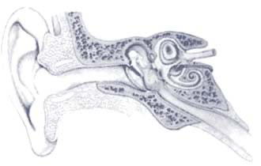

# Introduction

Lorem Ipsum is simply dummy text of the printing and typesetting industry. Lorem Ipsum has been the industry's standard dummy text ever since the 1500s, when an unknown printer took a galley of type and scrambled it to make a type specimen book. It has survived not only five centuries, but also the leap into electronic typesetting, remaining essentially unchanged. It was popularised in the 1960s with the release of Letraset sheets containing Lorem Ipsum passages, and more recently with desktop publishing software like Aldus PageMaker including versions of Lorem Ipsum.

# Fixed Media

Questa sezione illustra come utilizzare le principali funzionalità di Pandoc per la redazione della tesina: citazioni bibliografiche, tabelle, equazioni matematiche e figure.

---

# 1. CITAZIONI BIBLIOGRAFICHE

Le citazioni si basano sui file `.bib` presenti nella cartella `docs/` (bibliografia.bib, discografia.bib, sitografia.bib). Pandoc utilizza lo stile CSL specificato nel frontmatter per formattare automaticamente le citazioni.

## 1.1 Citazione semplice

Per citare un'opera in modo generico:

```text
La sintesi digitale è stata ampiamente studiata `[@delduca1987]`.
```

**Risultato:** La sintesi digitale è stata ampiamente studiata (Del Duca 1987).

## 1.2 Citazioni multiple

Per citare più opere contemporaneamente:

```text
Diversi autori hanno affrontato il tema `([@delduca1987]; [@bianchini2000]; [@dannenberg2003])`.
```

**Risultato:** Diversi autori hanno affrontato il tema ([@delduca1987]; [@bianchini2000]; [@dannenberg2003]).

## 1.3 Citazione con numero di pagina

Per citare una pagina specifica:

```text
Come sottolinea Del Duca `[@delduca1987, p. 17]`, la sintesi granulare...
```

**Risultato:** Come sottolinea Del Duca [@delduca1987, p. 17], la sintesi granulare...

## 1.4 Citazione testuale (blocco)

Per riportare una citazione letterale estesa, usa il simbolo `>`:


Come afferma Adorno [@adorno1959, p. 23]:

> La musica moderna richiede un'attenzione particolare 
> ai processi di sintesi e trasformazione del suono.
> Questi processi definiscono l'essenza stessa della composizione elettronica.


**Nota:** Ogni riga della citazione deve iniziare con `>`. La citazione apparirà rientrata nel PDF finale.

---

# 2. TABELLE

Pandoc supporta la creazione di tabelle con riferimenti incrociati. È fondamentale includere sia la didascalia (caption) che l'identificatore per poter richiamare la tabella nel testo.

## 2.1 Sintassi base

a       b       c
---     ---     ---
1       2       3
4       5       6
7       8       9

: Descrizione della tabella {#tbl:identificatore}


**Componenti essenziali:**    

- **Riga delle intestazioni:** `a  b  c` (separati da spazi o tab)
  
- **Riga di separazione:** `---  ---  ---` (indica dove iniziano i dati)
  
- **Righe di dati:** valori separati da spazi multipli
  
- **Didascalia:** `: Testo della didascalia`
  
- **Identificatore:** `{#tbl:nome}` (per i riferimenti incrociati)
  

## 2.2 Riferimento alla tabella

Per richiamare la tabella nel testo:

```text
Come si vede nella Tabella @tbl:identificatore, i risultati mostrano...
```

**Risultato:** Come si vede nella @tbl:identificatore, i risultati mostrano...

## 2.3 Esempio completo


Parametro       Valore      Unità
-----------     -------     ------
Frequenza       440         Hz
Durata          2.5         s
Ampiezza        0.8         dB

: Parametri dell'oscillatore {#tbl:parametri}


La Tabella @tbl:parametri mostra le impostazioni utilizzate nell'esperimento.


---

# 3. EQUAZIONI MATEMATICHE

Le equazioni utilizzano la sintassi LaTeX e possono essere referenziate nel testo grazie a `pandoc-crossref`.

## 3.1 Sintassi base


$$
E = mc^2
$$ {#eq:identificatore}


**Componenti:**

- **Delimitatori:** `$$` (apertura) e `$$` (chiusura)
  
- **Contenuto LaTeX:** formula matematica standard
  
- **Identificatore:** `{#eq:nome}` sulla stessa riga della chiusura
  

## 3.2 Riferimento all'equazione

```text
L'Equazione @eq:identificatore mostra la relazione energia-massa...
```

**Risultato:** @eq:identificatore mostra la relazione energia-massa...

## 3.3 Esempi comuni

**Formula semplice:**

$$
f(x) = x^2 + 2x + 1
$$ {#eq:polinomio}


**Formula con frazioni:**

$$
\frac{d}{dx}f(x) = \lim_{h \to 0} \frac{f(x+h) - f(x)}{h}
$$ {#eq:derivata}


**Sommatoria:**

$$
\sum_{i=1}^{n} x_i = x_1 + x_2 + \cdots + x_n
$$ {#eq:somma}


**Nota:** Per simboli e comandi avanzati, consulta la documentazione LaTeX.

---

# 4. FIGURE E IMMAGINI

Esistono due metodi principali per inserire immagini: la sintassi Pandoc (più semplice, con riferimenti automatici) e l'ambiente LaTeX `wrapfigure` (per testo che scorre attorno all'immagine).

## 4.1 Figure con Pandoc (metodo consigliato)

**Sintassi:**

```text
{#fig:identificatore width=60%}
```

**Componenti:**

- `!` indica che è un'immagine

- `[Didascalia]` testo che apparirà sotto la figura
  
- `(percorso)` path relativo al file (es. `docs/images/img001.png`)
  
- `{#fig:nome}` identificatore per riferimenti incrociati
  
- `width=XX%` larghezza in percentuale della pagina
  

**Esempio:**

{#fig:spettro width=70%}

La Figura @fig:spettro mostra la distribuzione delle frequenze nel tempo.


**Vantaggi:**
- Sintassi semplice e leggibile
- Numerazione automatica
- Riferimenti incrociati funzionanti

## 4.2 Wrapfigure (testo che scorre attorno)

Per far scorrere il testo attorno a un'immagine, usa l'ambiente LaTeX `wrapfigure`:


\begin{wrapfigure}{r}{0.4\textwidth}
  \centering
  \includegraphics[width=0.38\textwidth]{docs/images/img001.png}
  \caption{Diagramma esplicativo}
  \label{fig:diagramma}
\end{wrapfigure}

"Lorem ipsum dolor sit amet, consectetur adipiscing elit, sed do eiusmod tempor incididunt ut labore et dolore magna aliqua. Ut enim ad minim veniam, quis nostrud exercitation ullamco laboris nisi ut aliquip ex ea commodo consequat. Duis aute irure dolor in reprehenderit in voluptate velit esse cillum dolore eu fugiat nulla pariatur. Excepteur sint occaecat cupidatat non proident, sunt in culpa qui officia deserunt mollit anim id est laborum."


**Parametri:**

- `{r}` posizione: `r` (destra) o `l` (sinistra)
  
- `{0.4\textwidth}` larghezza dello spazio riservato all'immagine
  
- `[width=0.38\textwidth]` larghezza effettiva dell'immagine (leggermente inferiore)
  
- `\label{fig:nome}` identificatore LaTeX (NON usare `#fig:`)

**ATTENZIONE:**

- Con wrapfigure devi inserire **immediatamente dopo** un paragrafo di testo sufficientemente lungo
  
- Non funziona bene con elenchi puntati o altri elementi speciali
  
- Il riferimento si fa con `\ref{fig:nome}` in LaTeX, NON con `@fig:nome`
  

**Esempio d'uso corretto:**
```latex
\begin{wrapfigure}{r}{0.35\textwidth}
  \centering
  \includegraphics[width=0.33\textwidth]{docs/images/diagramma.png}
  \caption{Schema del processo}
  \label{fig:schema}
\end{wrapfigure}

Questo paragrafo deve essere abbastanza lungo da permettere al testo di 
scorrere correttamente attorno all'immagine. La sintesi granulare si basa 
sulla scomposizione del segnale audio in brevi segmenti temporali chiamati 
"grani", ognuno dei quali viene processato indipendentemente. Questa tecnica 
permette di ottenere trasformazioni sonore complesse...
```

## 4.3 Confronto: Pandoc vs Wrapfigure


 Caratteristica      Pandoc `![...]`           Wrapfigure 
 ---                 ---                       ---
 **Semplicità**      si Molto semplice          no Richiede LaTeX 
 **Riferimenti**     si `@fig:nome`             no `\ref{fig:nome}` 
 **Posizionamento**  Centro pagina             Testo attorno 
 **Quando usare**    Maggior parte dei casi    Solo se necessario 

: Descrizione della tabella {#tbl:tab}

**Raccomandazione:** Usa la sintassi Pandoc (`![...]`) come default. Ricorri a `wrapfigure` solo quando hai davvero bisogno che il testo scorra attorno all'immagine.

---

# 5. RIEPILOGO RAPIDO

## Citazioni
- Semplice: `[@chiave]`
- Con pagina: `[@chiave, p. 17]`
- Multiple: `[@chiave1]; [@chiave2]`
- Blocco: righe che iniziano con `>`

## Tabelle

```csound
col1    col2    col3
---     ---     ---
a       b       c

: Didascalia {#tbl:nome}

Riferimento: `@tbl:nome`
```

## Equazioni

$$
formula LaTeX
$$ {#eq:nome}

Riferimento: `@eq:nome`

## Figure

{#fig:nome width=60%}

Riferimento: @fig:nome

---

# 6. CONSIGLI PRATICI

1. **Identificatori univoci:** Usa nomi descrittivi e unici per ogni elemento (`#fig:spettrogramma`, `#tbl:risultati`, `#eq:fourier`)

2. **Percorsi delle immagini:** Usa sempre percorsi relativi dalla root del progetto (es. `docs/images/foto.png`)

3. **Dimensioni immagini:** Parti da `width=60%` e aggiusta in base alle necessità (valori comuni: 40%, 50%, 70%, 80%)

4. **Riferimenti incrociati:** Usa sempre `@fig:`, `@tbl:`, `@eq:` per riferimenti automatici che si aggiornano con la numerazione

5. **Bibliografia:** Assicurati che le chiavi nel file `.bib` corrispondano esattamente a quelle usate nelle citazioni (case-sensitive!)

6. **Testing:** Compila frequentemente il PDF per verificare che riferimenti e citazioni funzionino correttamente

---

# Sezione di esempio con tutti gli elementi

Di seguito un esempio che integra tutti gli elementi:

La sintesi granulare, introdotta da Curtis Roads [@dannenberg2003], si basa sulla manipolazione di brevi segmenti sonori. Come afferma Del Duca [@delduca1987, p. 45]:

> La granularità del suono permette un controllo microscopico 
> della materia sonora, aprendo possibilità compositive inedite.

{#fig:grano width=50%}

La Figura @fig:grano illustra la struttura temporale di un singolo grano. I parametri fondamentali sono riassunti nella Tabella @tbl:param_grano.

```csound
Parametro       Range           Descrizione
-----------     -----------     --------------------------
Durata          5-100 ms        Lunghezza del grano
Inviluppo       Gaussiano       Forma della finestra
Densità         10-1000 Hz      Frequenza di emissione
```

: Parametri della sintesi granulare {#tbl:param_grano}

La relazione tra densità e sovrapposizione è espressa dall'Equazione @eq:overlap:

$$
O = \frac{D \cdot T}{1000}
$$ {#eq:overlap}

dove $O$ è il fattore di sovrapposizione, $D$ la densità in Hz e $T$ la durata in millisecondi.


# Diffusion

# DSP

# Electroacoustic Chain

# Performance Instructions

# Thanks

Eppur si muove...


# BIBLIOGRAFIA

::: {#refs-bib}
:::

# DISCOGRAFIA

::: {#refs-dis}
:::

# SITOGRAFIA

::: {#refs-sit}
:::

