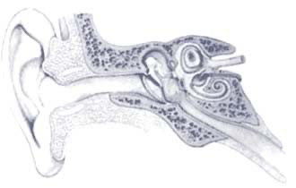

# Introduction

**Incontri** is a collective project of acousmatic music exploration by the $z^{-1}$ group. It investigates various aspects of the creative process, aiming to foster the convergence of individual experiences and creating a context for reflection and dialogue around the realization of acousmatic music.

The project focuses on key themes such as the relationship between timbre and space. Sound cannot be considered independently of the way it inhabits space; therefore, space itself becomes a new timbral and compositional parameter, one that both influences and is influenced by other parameters. Additionally, Incontri examines the nature of acousmatic music in the present context, questioning what it means to create and interpret an acousmatic piece today. It explores the aesthetic and technical implications of acousmatic composition, with particular emphasis on the role of the performer in sound direction and in the performance of acousmatic music itself.

In this sense, the interpretation of acousmatic music is central, specifically as it relates to the execution of a piece. The project invites a deeper understanding of the performer's role in the realization of acousmatic works.

# Fixed Media

1. **Pietro Barale** – _Voci Notturne_ (2025)

2. **Edoardo Scioscia** – _Spatium Temporis - (Studio sui comportamenti non periodici dell'aria)_ (2024)

3. **Luca Spanedda** – _SITI: Sound Is The Interaction_ (2025)

4. **Francesco Ferracuti** – _ThisPlace_ (2025)

5. **Giulio Romano De Mattia** – _Gamma_ (2025)

6. **Filippo Fossà** – _Teronirica (Bestiario del sogno)_ (2025)

7. **Davide Tedesco** – _Materico_ (2025)

***

The performance will take place without intermissions, with all pieces being managed live at the mixing desk.

# Diffusion

Test 

\begin{tikzpicture}[line join = round, line cap = round]

% Tetra NORD
\begin{scope}[shift={(0,3)}]
\coordinate (3) at (0,{sqrt(2)},0);
\coordinate (2) at ({-.5*sqrt(3)},0,-.5);
\coordinate (1) at (0,0,1);
\coordinate (0) at ({.5*sqrt(3)},0,-.5);

\draw[densely dotted] (0)--(2);
\draw[fill=lightgray, fill opacity=.5] (1)--(0)--(3)--cycle;
\draw[fill=gray, fill opacity=.5] (2)--(1)--(3)--cycle;
\end{scope}

% Tetra SUD
\begin{scope}[shift={(0,-3)}]
\coordinate (3) at (0,{sqrt(2)},0);
\coordinate (2) at ({-.5*sqrt(3)},0,-.5);
\coordinate (1) at (0,0,1);
\coordinate (0) at ({.5*sqrt(3)},0,-.5);

\draw[densely dotted] (0)--(2);
\draw[fill=lightgray, fill opacity=.5] (1)--(0)--(3)--cycle;
\draw[fill=gray, fill opacity=.5] (2)--(1)--(3)--cycle;
\end{scope}

% Tetra EST
\begin{scope}[shift={(3,0)}]
\coordinate (3) at (0,{sqrt(2)},0);
\coordinate (2) at ({-.5*sqrt(3)},0,-.5);
\coordinate (1) at (0,0,1);
\coordinate (0) at ({.5*sqrt(3)},0,-.5);

\draw[densely dotted] (0)--(2);
\draw[fill=lightgray, fill opacity=.5] (1)--(0)--(3)--cycle;
\draw[fill=gray, fill opacity=.5] (2)--(1)--(3)--cycle;
\end{scope}

% Tetra OVEST
\begin{scope}[shift={(-3,0)}]
\coordinate (3) at (0,{sqrt(2)},0);
\coordinate (2) at ({-.5*sqrt(3)},0,-.5);
\coordinate (1) at (0,0,1);
\coordinate (0) at ({.5*sqrt(3)},0,-.5);

\draw[densely dotted] (0)--(2);
\draw[fill=lightgray, fill opacity=.5] (1)--(0)--(3)--cycle;
\draw[fill=gray, fill opacity=.5] (2)--(1)--(3)--cycle;
\end{scope}

\end{tikzpicture}

\begin{tikzpicture}[scale=1]
    \newcommand{\speaker}[3]{
    % #1 = x coordinate center
    % #2 = y coordinate center
    % #3 = rotation angle (0, 90, 180, 270)
    \begin{scope}[shift={(#1,#2)}, rotate=#3]
	% Triangolo che indica la direzione di emissione
	\draw[very thick, fill=speaker] (0,0) -- (-0.4,0.7) -- (0.4,0.7) -- cycle;
	% Linee interne opzionali per dettaglio
	\draw[thick] (0,0.2) -- (0,0.5);
    \end{scope}
    }    
    
    % Definizione colori
    \definecolor{sala}{RGB}{240,240,245}
    \definecolor{pubblico}{RGB}{200,230,255}
    \definecolor{regia}{RGB}{255,220,220}
    \definecolor{speaker}{RGB}{50,50,50}
    
    % SALA
    \fill[sala] (-6,-6) rectangle (6,6);
    \draw[very thick] (-6,-6) rectangle (6,6);
    
    % REGIA DEL SUONO
    \draw[thick, fill=regia] (-0.8,-1.2) rectangle (0.8,-1.8);
    \node at (0,-1.5) {\small\textbf{REGIA}};
    \node[below, font=\tiny] at (0,-1.8) {Console diffusione};
   
    % Speakers
    \speaker{0}{4.5}{180}
    \speaker{0}{-4.5}{0}
    \speaker{-4.5}{0}{270}
    \speaker{4.5}{0}{90}
    \speaker{0}{-.7}{0}    
    
    % Cerchio di ascolto ideale
    \draw[thick, dotted, purple] (0,0) circle (5.5);
    
    % Quote dimensioni sala
    \draw[<->, >=Stealth] (-6,-6.5) -- (6,-6.5);
    \node[below] at (0,-6.5) {8m};
    \draw[<->, >=Stealth] (-6.5,-6) -- (-6.5,6);
    \node[left, rotate=90] at (-6.5,0) {8m};
\end{tikzpicture}

# DSP

Equations for channels 1 and 2: LEFT (x) and RIGHT (y) is as follow:

- **MID**: $\frac{x + y}{2}$
- **SIDE**: $\frac{x - y}{2}$
- **LEFT**: $x$
- **RIGHT**: $y$

4 Channels in output.

\lstinputlisting{docs/src/sdmx.dsp}

{#fig:identificatore width=60%}

# Electroacoustic Chain

# Performance Instructions

# Thanks

Eppur si muove...

questo **potrebbe** essere il sommario...

# BIBLIOGRAFIA

::: {#refs-bib}
:::

# DISCOGRAFIA

::: {#refs-dis}
:::

# SITOGRAFIA

::: {#refs-sit}
:::

